# Collaborators

::: {.collaborator-list}

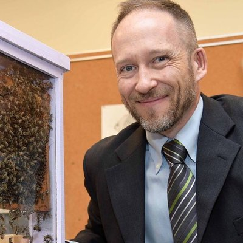

Dr. Kirk Hillier

Acadia University (Canada)

<!-- 
**Project:** Chemical Ecology and Insect Neurobiology
 -->
<a href="https://www.acadiau.ca/~khillier/" class="collab-site" target="_blank">
<i class="bi bi-globe"></i> Website
</a>

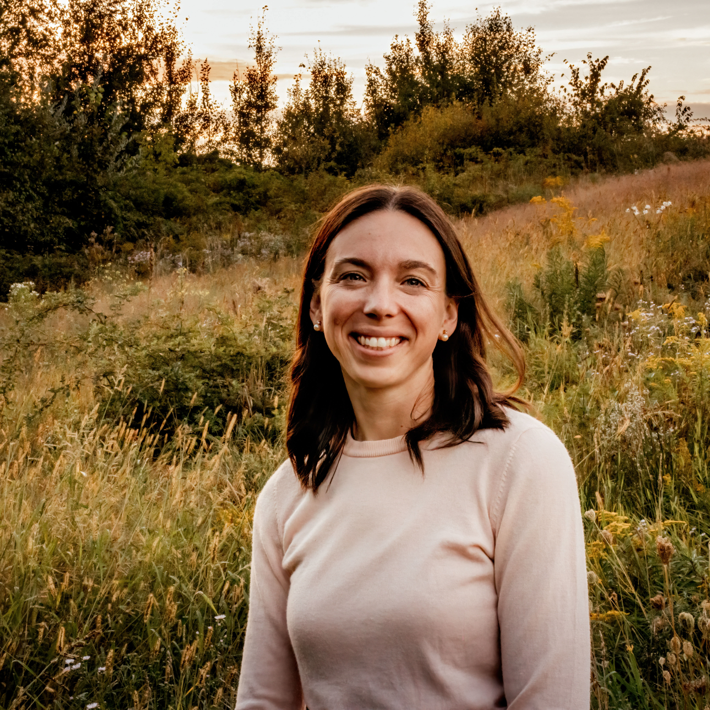

Dr. Laura Ferguson

Acadia University (Canada)

<!-- 
**Project:** Chemical Ecology and Insect Neurobiology
 -->
<a href="https://www.fergusonlab.ca/" class="collab-site" target="_blank">
<i class="bi bi-globe"></i> Website
</a>

Dr. Suzie Currie

University of British Columbia (BC) (NS)

**Project:** Behavioural and neuropharmacological investigation of psilocybin as an innovative therapeutic agent for the treatment of mental health disorders

<a href="https://biology.ok.ubc.ca/about/contact/suzie-currie/" class="collab-site" target="_blank">
<i class="bi bi-globe"></i> Website
</a>

Dr. Douglas Chaves

Rural Federal University of Rio de Janeiro (Brazil)

**Project:** Natural products and development of novel formulations based on essential oils for the management of veterinary pests

<a href="https://departamentos.ufrrj.br/icbs-dcfar/2025/05/29/douglas-siqueira-de-almeida-chaves/" class="collab-site" target="_blank">
<i class="bi bi-globe"></i> Website
</a>

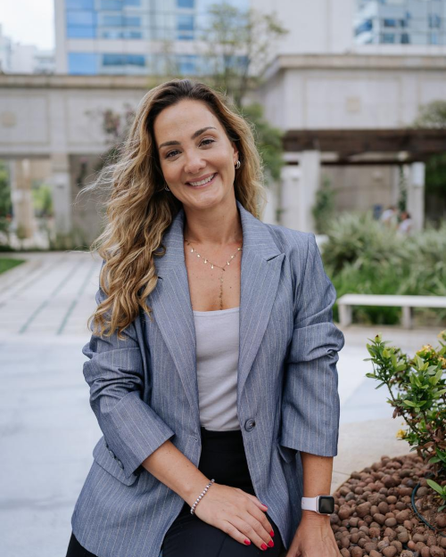

Dr. Yara Peluso Cid

Rural Federal University of Rio de Janeiro (Brazil)

**Project:** Acaricidal activities of Brazilian essential oils on different tick species

<a href="https://departamentos.ufrrj.br/icbs-dcfar/2025/05/29/yara-peluso-cid/" class="collab-site" target="_blank">
<i class="bi bi-globe"></i> Website
</a>

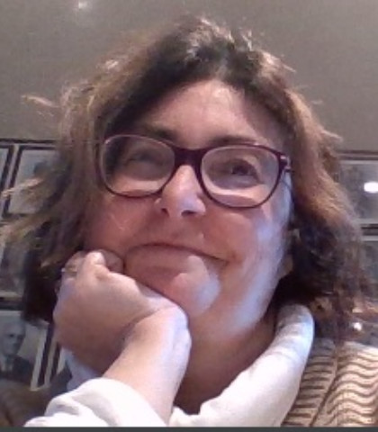

Dr. Antonella Maggio

Università degli Studi di Palermo (Italy)

**Project:** Essential oils from <i>Artemisia</i> spp. in tick control

<a href="https://www.unipa.it/persone/docenti/m/antonella.maggio" class="collab-site" target="_blank">
<i class="bi bi-globe"></i> Website
</a>

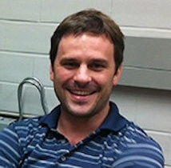

Dr. Jamie Kramer

Dalhousie University (Canada)

**Project:** The mechanism of psilocybin activity on neuronal function and post-traumatic stress disorder

<a href="https://medicine.dal.ca/departments/department-sites/biochemistry-molecular-biology/our-people/faculty/kramer.html" class="collab-site" target="_blank">
<i class="bi bi-globe"></i> Website
</a>

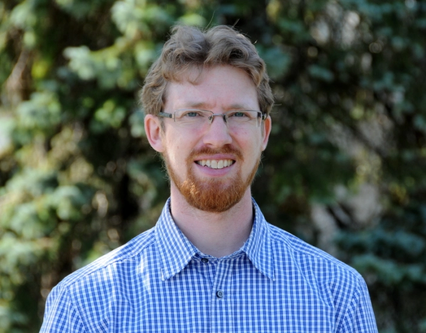

Dr. Patrick Leighton

University of Montreal (Canada)

**Project:** Canadian Lyme Disease Research Network – Active tick surveillance in sentinel surveillance network

<a href="https://patrickleighton.com/" class="collab-site" target="_blank">
<i class="bi bi-globe"></i> Website
</a>

Dr. Kapil Thalan

Memorial University of Newfoundland (Canada)

**Project:** Microbiomes and metabolomes of lichens with traditional Mi’kmaq use in Nova Scotia

<a href="https://www.mun.ca/biology/ktahlan/" class="collab-site" target="_blank">
<i class="bi bi-globe"></i> Website
</a>

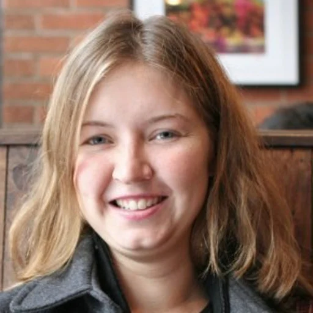

Dr. Allison Walker

Acadia University (NS)

**Project:** Antifungal activities of essential oil synergistic mixture

<a href="https://bayoffungi.wordpress.com/" class="collab-site" target="_blank">
<i class="bi bi-globe"></i> Website
</a>

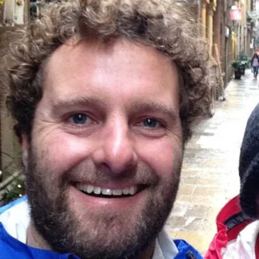

Dr. Jacob Corcoran

USDA (MO, USA)

**Project:** Chemical Ecology of squash bug, Anasa tristis

<a href="https://scholar.google.com/citations?user=5_tDQtcAAAAJ&hl=en" class="collab-site" target="_blank">
<i class="bi bi-globe"></i> Website
</a>

Dr. Chris Cutler

Dalhousie University (NS)

**Project:** Synthetic plant-based insecticidal synergists

<a href="https://www.dal.ca/faculty/agriculture/faculty/pfes/christopher-cutler.html" class="collab-site" target="_blank">
<i class="bi bi-globe"></i> Website
</a>

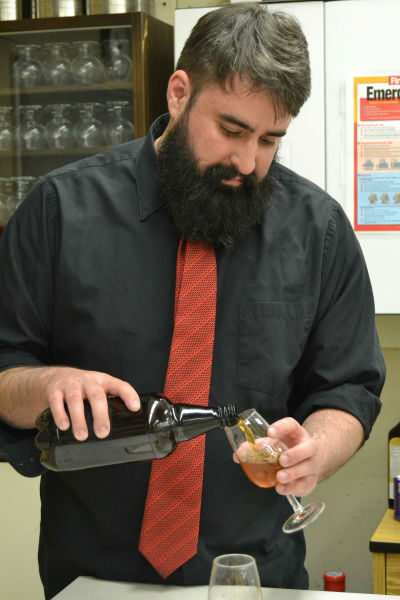

Dr. Matt McSweeney

Acadia University (NS)

**Project:** Rock dust as soil amendment: effects on crop quality and production; Cannabis-infused beverages for recreational markets

<a href="https://nutrition.acadiau.ca/Matt_McSweeney.html" class="collab-site" target="_blank">
<i class="bi bi-globe"></i> Website
</a>

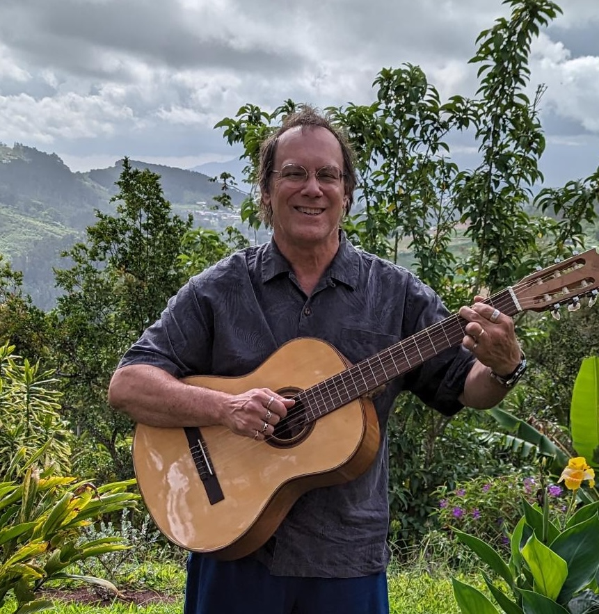

Dr. Russell Easy

Acadia University (NS)

**Project:** Sustainability and optimization in Cannabis production

<a href="https://easylab.acadiau.ca/home.html" class="collab-site" target="_blank">
<i class="bi bi-globe"></i> Website
</a>

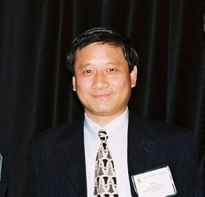

Dr. Jerry Zhu

USDA (NE, USA)

**Project:** Olfactory basis of tick behavior and novel repellent development

<a href="https://scholar.google.com/citations?user=sHiX3z4AAAAJ&hl=en" class="collab-site" target="_blank">
<i class="bi bi-globe"></i> Website
</a>

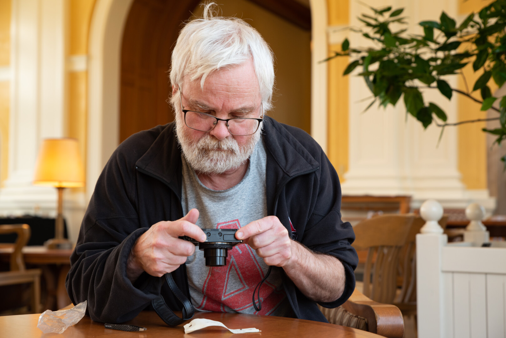

Dr. Dave Shutler

Acadia University (NS)

**Project:** Chemical ecology of bird nest volatiles

<a href="https://www.acadiau.ca/~dshutler/" class="collab-site" target="_blank">
<i class="bi bi-globe"></i> Website
</a>

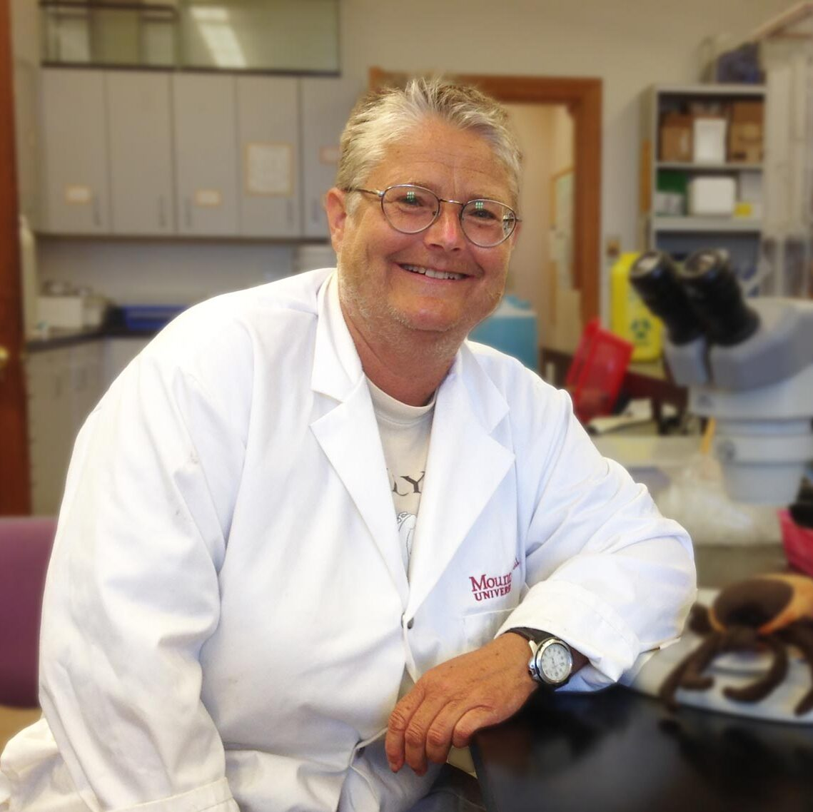

Dr. Vett Lloyd

Mount Allison University (NB)

**Project:** Olfactory basis of tick behavior and novel repellent development

<a href="https://mta.ca/directory/vett-lloyd" class="collab-site" target="_blank">
<i class="bi bi-globe"></i> Website
</a>

# Industrial collaborators

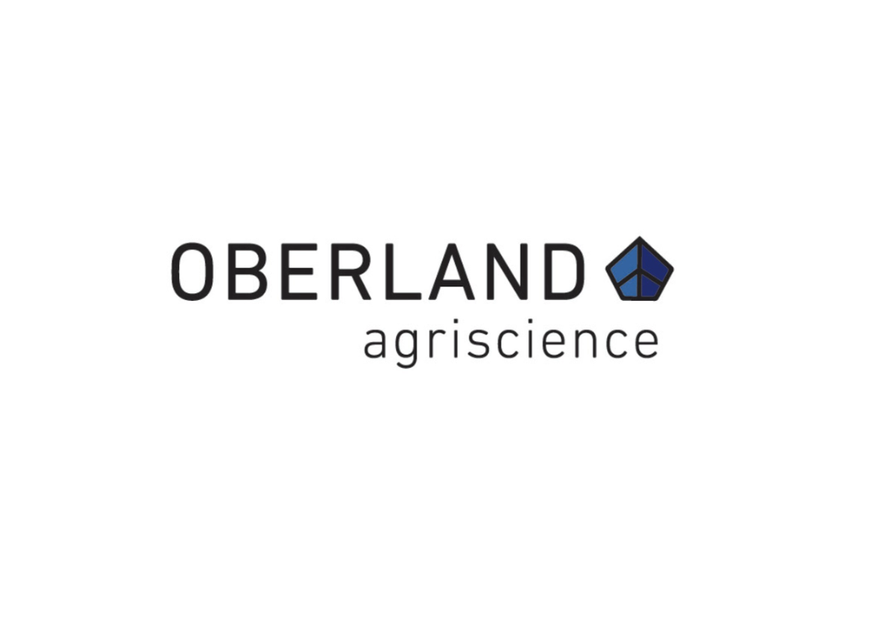

Oberland Agri-Science Inc., Halifax (NS)

**Project:** Technology for enhancement of egg-laying by soldier flies

<a href="https://oberlandagriscience.com/" class="collab-site" target="_blank">
<i class="bi bi-globe"></i> Website
</a>

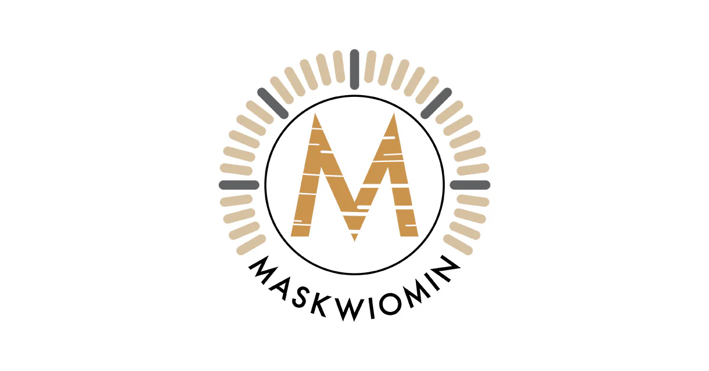

Maskwiomin Mi’kmaq Birch Bark Extract, Sydney (NS)

**Project:** Birch bark extract as tick and mosquito repellents

<a href="https://maskwiomin.com/" class="collab-site" target="_blank">
<i class="bi bi-globe"></i> Website
</a>

PureGard Botanical Repellent / Atlantick®, Mahone Bay (NS)

**Project:** Tick repellent natural-based products

<a href="https://puregard.ca/" class="collab-site" target="_blank">
<i class="bi bi-globe"></i> Website
</a>

:::

# Support & Funding

::: {.support-logos}

  <a href="https://nserc-crsng.canada.ca/en" class="logo-item" target="_blank">
    
    Natural Sciences and Engineering Research Council of Canada

  </a>

  <a href="https://www.innovation.ca/" class="logo-item" target="_blank">
    
    Canada Foundation for Innovation
  </a>

  <a href="https://www.mitacs.ca/" class="logo-item" target="_blank">
    
    Mitacs
  </a>
  
  <a href="https://www.canada.ca/en/atlantic-canada-opportunities.html" class="logo-item" target="_blank">
    
    Atlantic Canada Opportunities Agency
  </a>

  <a href="https://puregard.ca/" class="logo-item" target="_blank">
    
    PureGard
  </a>
  
  <a href="https://canlyme.com/" class="logo-item" target="_blank">
    
    CanLyme Foundation
  </a>
  
  <a href="https://researchns.ca/" class="logo-item" target="_blank">
    
    Research Nova Scotia
  </a>
  

:::