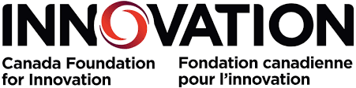

# Support & Funding

::: {.support-logos}

  <a href="https://nserc-crsng.canada.ca/en" class="logo-item" target="_blank">
    
    Natural Sciences and Engineering Research Council of Canada

  </a>

  <a href="https://www.innovation.ca/" class="logo-item" target="_blank">
    
    Canada Foundation for Innovation
  </a>

  <a href="https://www.mitacs.ca/" class="logo-item" target="_blank">
    
    Mitacs
  </a>

:::

***

# Collaborators

::: {.collaborator-list}

Dr. Kirk Hillier

Acadia University (Canada)

<!-- 
**Project:** Chemical Ecology and Insect Neurobiology
 -->
<a href="https://www.acadiau.ca/~khillier/" class="collab-site" target="_blank">
<i class="bi bi-globe"></i> Contact
</a>

Dr. Laura Ferguson

Acadia University (Canada)

<!-- 
**Project:** Chemical Ecology and Insect Neurobiology
 -->
<a href="https://www.fergusonlab.ca/" class="collab-site" target="_blank">
<i class="bi bi-globe"></i> Contact
</a>

:::