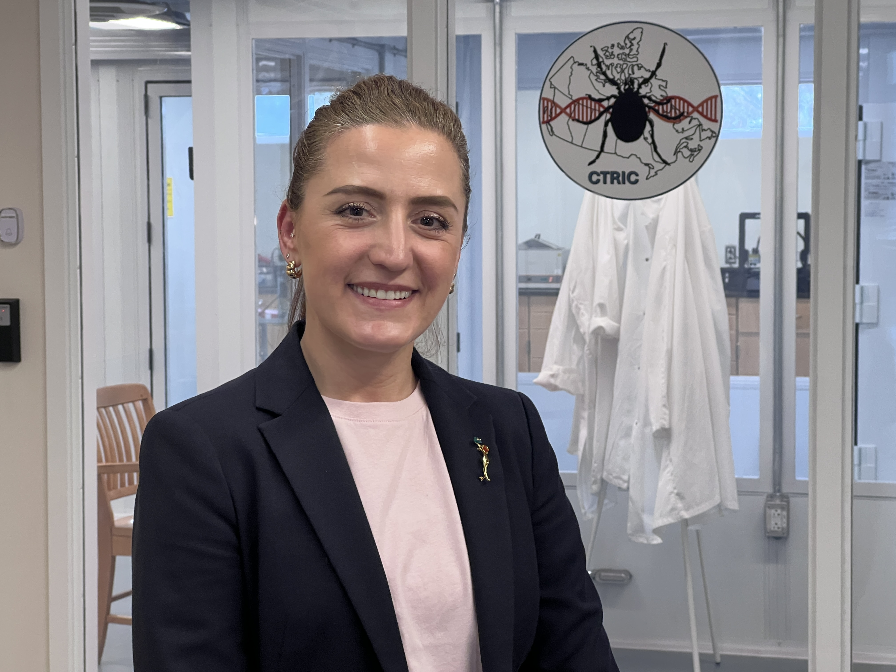
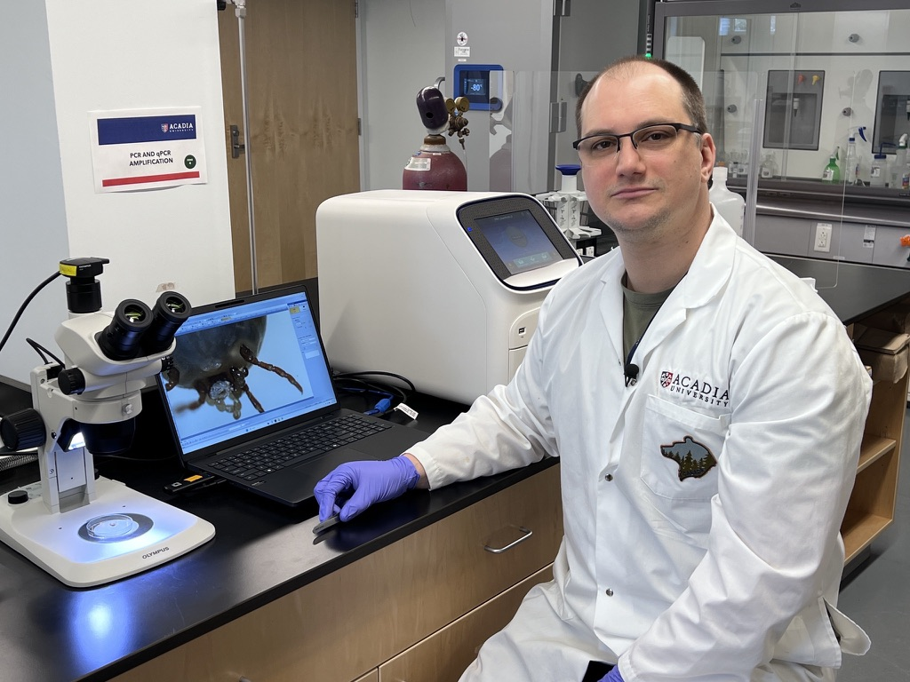
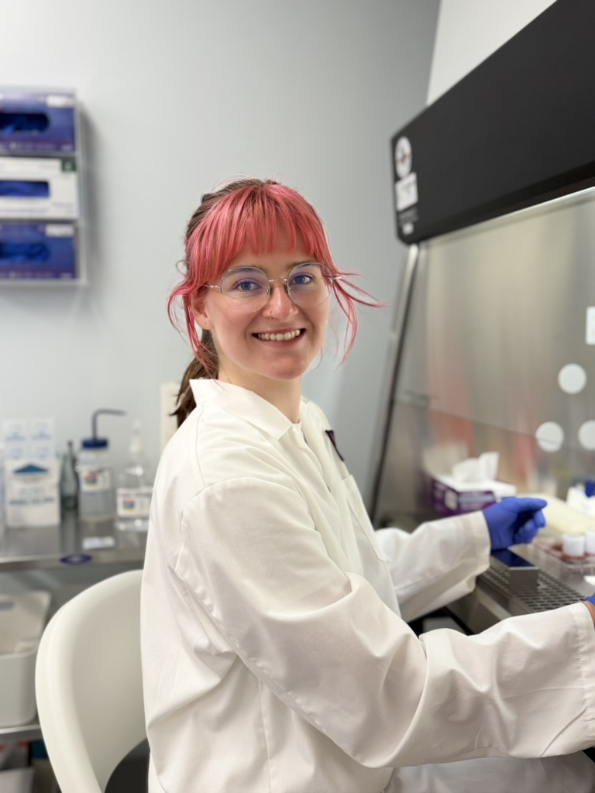
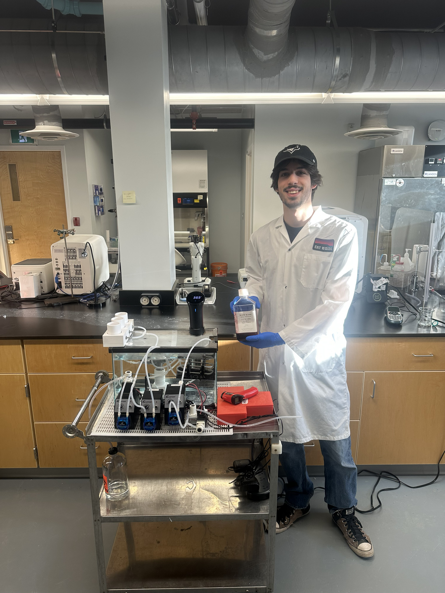

<!-- ═══════════════════════════════════════
     HERO
════════════════════════════════════════ -->
::: {.ctric-hero}
::: {.ctric-container}
[Acadia University · Wolfville, NS, Canada]{.ctric-eyebrow}

## [**Canadian Tick Research & Innovation Centre**]{.ctric-hero-title}

[Advancing Canada's capacity in tick rearing, pathogen diagnostics, and repellency research — protecting human, animal, and ecosystem health.]{.ctric-hero-sub}
:::
:::
<!-- ═══════════════════════════════════════
     WHO WE ARE
════════════════════════════════════════ -->

::: {.ctric-section}
::: {.ctric-container}

[Who we are]{.ctric-section-tag}

## A national hub for tick science

[CTRIC is a dedicated research and commercial laboratory housed within Acadia University's Huestis Innovation Pavilion. We bring together leading researchers, government partners, and industry to tackle one of Canada's fastest-growing public health challenges. Ticks and tick-borne diseases now affect thousands of Canadians each year, with case counts nearly doubling between 2022 and 2024. Climate change is accelerating tick range expansion — and Canada needs a domestic centre of excellence to respond.]{.ctric-section-sub}

::: {style="text-align: center;"}

:::

::: {.ctric-card-grid}

::: {.ctric-card}
**🔬 Built on proven expertise**

Our team brings together diverse expertise across tick biology, chemical ecology, molecular diagnostics, and thermal physiology.
:::

::: {.ctric-card}
**🏘️ Rooted in Atlantic Canada**

Located in Wolfville, NS, CTRIC creates skilled employment in rural Atlantic Canada while delivering national and international impact through research, innovation, and strategic partnerships.
:::

::: {.ctric-card}
**🛡️ Biosafety first**

CTRIC operates under biosafety standards, ensuring that all ticks produced are rigorously screened and pathogen-free. Our purpose-built containment facility protects staff, partners, and the environment while meeting the biosafety requirements for working with live ticks and tick-borne pathogens.
:::

::: {.ctric-card}
**🔄 Reducing foreign dependency**

CTRIC will provide locally reared ticks that are genetically relevant to Canadian environments, produced under rigorous biosafety standards — alongside fast, reliable pathogen testing for tick-borne diseases.
:::

:::

:::
:::

<!-- ═══════════════════════════════════════
     WHAT WE DO
════════════════════════════════════════ -->

::: {.ctric-section .ctric-section-alt}
::: {.ctric-container}

[What we do]{.ctric-section-tag}

## Three core service streams

[CTRIC will offer specialized, fee-for-service capabilities to universities, government agencies, and industry partners across Canada and internationally.]{.ctric-section-sub}

:::: {.ctric-pillar}
::: {.ctric-pillar-body}
**Tick rearing & supply**

Large-scale rearing of *Ixodes scapularis* (blacklegged tick) and *Dermacentor variabilis* (American dog tick) using artificial feeding systems — no live animals required. Canadian-reared ticks for academic, government, and commercial clients, with distribution beginning soon.
:::
::::

:::: {.ctric-pillar}
::: {.ctric-pillar-body}
**Pathogen testing & diagnostics**

Molecular testing for Lyme disease (*Borrelia* spp.), *Anaplasma*, *Babesia*, *Rickettsia*, and other emerging tick-borne pathogens. Fee-for-service testing for researchers, health agencies, and commercial partners.
:::
::::

:::: {.ctric-pillar}
::: {.ctric-pillar-body}
**Repellency & acaricidal testing**

Controlled laboratory evaluation of acaricides and repellents under standardized conditions. Supports Health Canada PMRA product registration and new product development for industry partners, including start-ups and established repellent and veterinary health companies.
:::
::::

:::
:::

<!-- ═══════════════════════════════════════
     WELCOME TO THE LAB
════════════════════════════════════════ -->

::: {.ctric-section}
::: {.ctric-container}

[Welcome to the lab]{.ctric-section-tag}

## CTRIC and its amenities

[Once operational, CTRIC will be housed within Acadia's Huestis Innovation Pavilion — purpose-built for tick research, from colony maintenance and live tick supply to pathogen diagnostics and product testing.]{.ctric-section-sub}

::: {.ctric-amenity-grid}

::: {.ctric-amenity-card}
[Tick rearing]{.ctric-amenity-header}

CTRIC will maintain year-round colonies of *Ixodes scapularis* and *Dermacentor variabilis* under controlled conditions, producing healthy, pathogen-screened ticks at every life stage. Ticks will be available for supply to research institutions, government agencies, and commercial partners, with the scale and consistency needed to support long-term programs.
:::

::: {.ctric-amenity-card}
[Tick pathogen testing]{.ctric-amenity-header}

CTRIC will offer fast, reliable detection of tick-borne pathogens — including *Borrelia* spp., *Anaplasma*, *Babesia*, and *Rickettsia* — in ticks submitted by researchers, public health agencies, and surveillance programs. Results will support disease monitoring, risk mapping, and research across Canada.
:::

::: {.ctric-amenity-card}
[Repellency & acaricidal testing]{.ctric-amenity-header}

CTRIC will test repellents, treated fabrics, and acaricidal formulations against live ticks under standardized laboratory conditions. Testing will generate the efficacy data needed for Health Canada PMRA registration, supporting the development of new products from early-stage research through to regulatory submission.
:::

:::

:::
:::

<!-- ═══════════════════════════════════════
     MEET THE TEAM
════════════════════════════════════════ -->

::: {.ctric-section .ctric-section-alt}
::: {.ctric-container}

[Meet our team]{.ctric-section-tag}

## The people behind CTRIC

[Our multidisciplinary team spans tick biology, chemical ecology, molecular diagnostics, and business development.]{.ctric-section-sub}

::: {.ctric-team-grid}

::: {.ctric-team-card}
{.ctric-team-photo}

**Dr. Nicoletta Faraone**

[Director]{.ctric-team-role}

[Department of Chemistry, Acadia University]{.ctric-team-affil}
:::

::: {.ctric-team-card}
{.ctric-team-photo}

**Dr. Luis Anholeto**

[Lab Manager]{.ctric-team-role}

[Department of Chemistry, Acadia University]{.ctric-team-affil}
:::

::: {.ctric-team-card}
{.ctric-team-photo}

**Gemma Rawson, M.S.**

[Research Technician]{.ctric-team-role}

[Department of Chemistry, Acadia University]{.ctric-team-affil}
:::

::: {.ctric-team-card}
{.ctric-team-photo}

**Noah Cull**

[Research Assistant — Engineering Student]{.ctric-team-role}

[Department of Chemistry, Acadia University]{.ctric-team-affil}
:::

::: {.ctric-team-card}
{.ctric-team-photo}

**Dr. Kirk Hillier**

[Collaborator — Chemical ecology & pest management]{.ctric-team-role}

[Department of Biology, Acadia University]{.ctric-team-affil}
:::

::: {.ctric-team-card}
{.ctric-team-photo}

**Dr. Laura Ferguson**

[Collaborator — Climate, thermal biology & vector behaviour]{.ctric-team-role}

[Department of Biology, Acadia University]{.ctric-team-affil}
:::

:::

:::
:::
