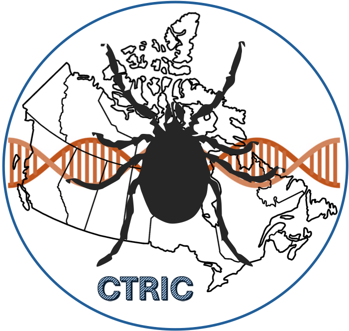
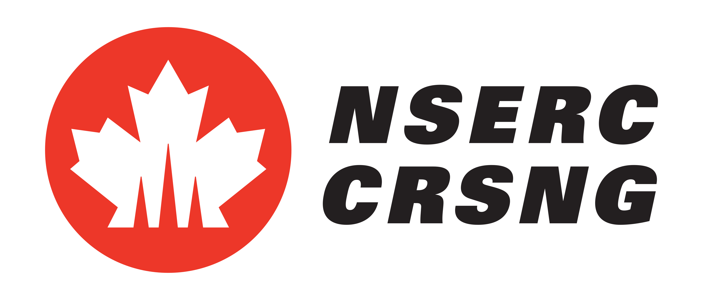
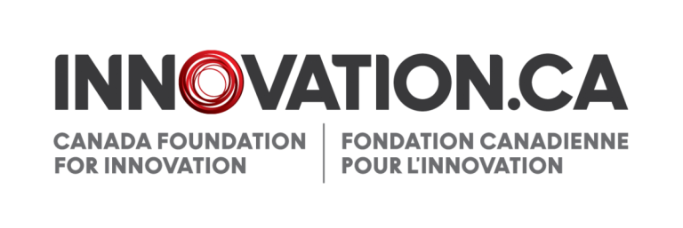
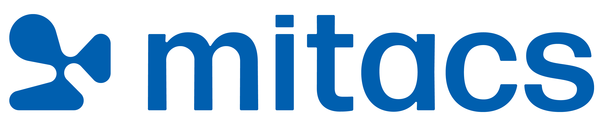
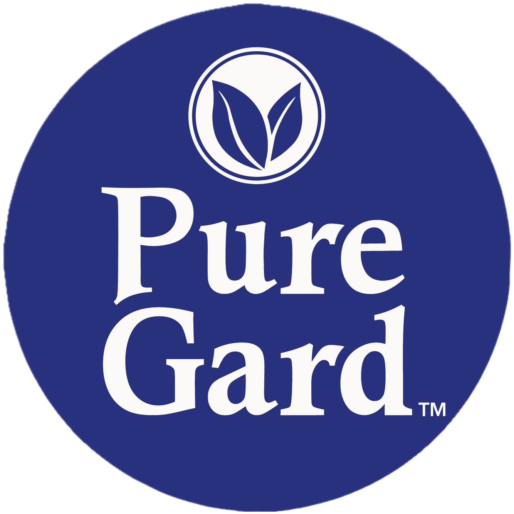
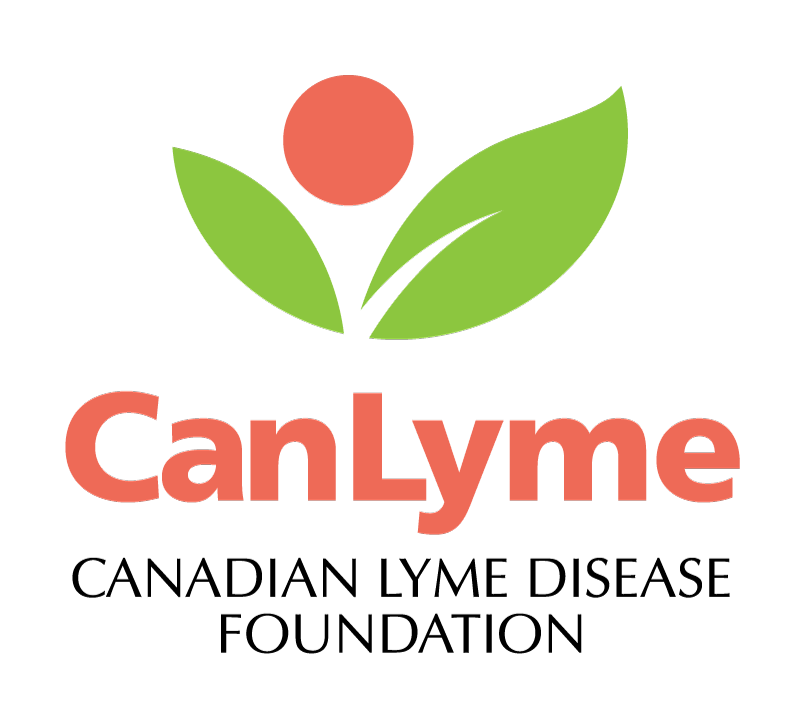
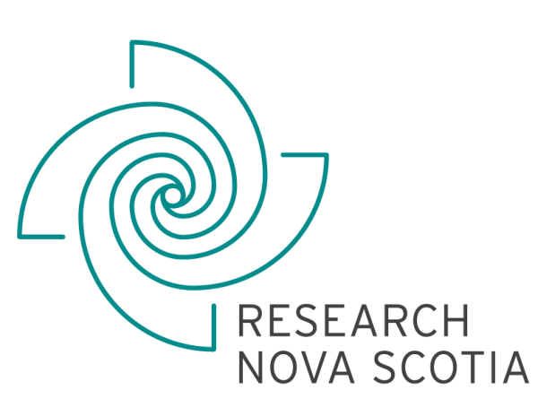

::: cmm-preload
:::

:::: gradient-text
::: welcome-headline
Welcome to the Faraone Research Group 
:::
::::

::::: cmm-background
:::: content-container
::: welcome
:::
::::
:::::

We are an interdisciplinary research group focused on **chemical ecology**, **natural product chemistry**, and **vector biology**. Our research investigates how ticks detect hosts and respond to repellents, translating fundamental discoveries into innovative, environmentally responsible solutions for tick management and disease prevention.

------------------------------------------------------------------------

# Coming Soon: Canada’s First Tick Research & Innovation Centre

Something big is hatching at Acadia University.

In 2026, the [**Canadian Tick Research & Innovation Centre (CTRIC)**](ctric/index.qmd) will open in the Huestis Innovation Pavilion — the first facility of its kind in Canada.

With dedicated tick rearing (“tickery”), pathogen testing, and repellent evaluation, CTRIC will strengthen national efforts to understand, prevent, and manage ticks and tick-borne diseases.

**Stay tuned.**

::: {style="text-align: center;"}

:::

------------------------------------------------------------------------

# Latest news

::: {#latest-news}
:::

::: {style="text-align: center; margin-top: 20px;"}
<a href="/news/index.qmd" class="btn btn-outline-primary btn-lg" role="button"> View All News </a>
:::

------------------------------------------------------------------------

::::::::::: support-section
# Support & Funding

:::::::::: logo-grid
::: logo-item

:::

::: logo-item

:::

::: logo-item

:::

::: logo-item

:::

::: logo-item

:::

::: logo-item

:::

::: logo-item

:::
::::::::::
:::::::::::
