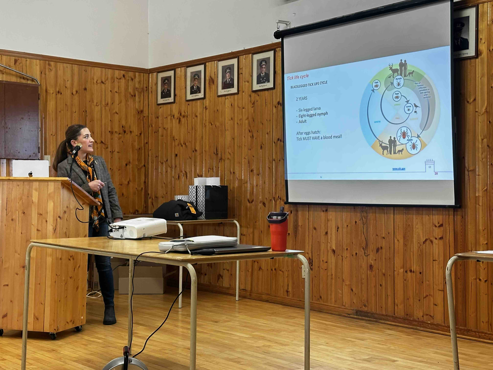

{fig-align="center" width="450"}

Dr. Nicoletta Faraone was invited to speak at the Nova Scotia Cattle Producers Annual General Meeting, where she presented research on ticks affecting humans and farm animals in Atlantic Canada. Her talk highlighted current challenges related to tick expansion, risks to farm and companion animals, human health, and ongoing research in the Faraone Research Group aimed to developing innovative and environmentally responsible strategies for tick management. The presentation also provided an opportunity to engage directly with Nova Scotian cattle producers and discuss practical approaches to reducing tick exposure on farms.

