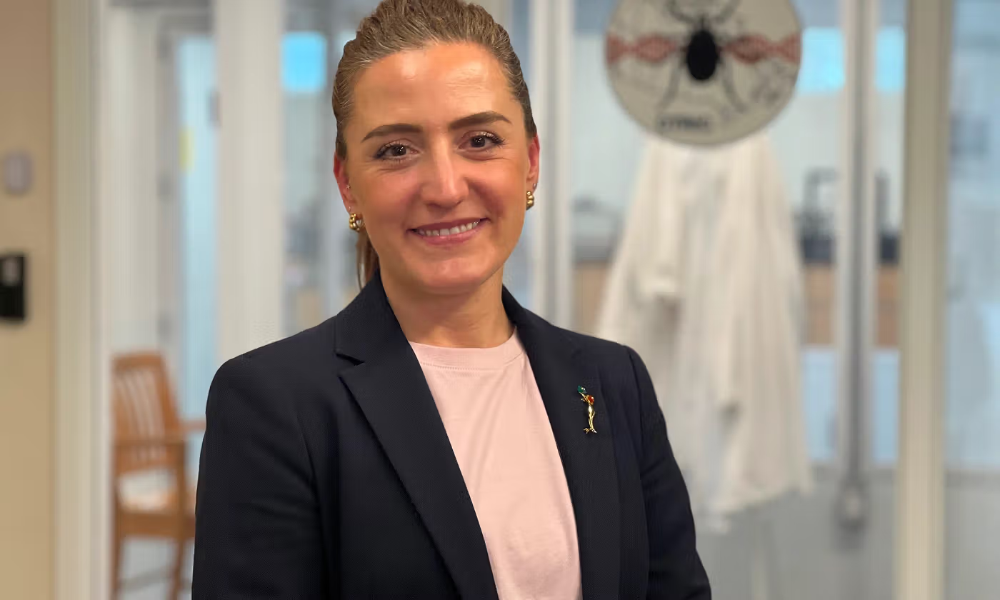

{fig-align="center"}

Dr. Nicoletta Faraone of Acadia University is spearheading the establishment of the Canadian Tick Research and Innovation Centre (CTRIC), the first facility of its kind in Canada designed to provide researchers with affordable, pathogen-free ticks. Currently, Canadian scientists must import expensive specimens from the United States, but this new "tickery" aims to achieve "tick sovereignty" by breeding local blacklegged and American dog ticks that are genetically adapted to the Canadian climate. Slated to be fully operational later in 2026, the center will serve as a national hub for monitoring tick-borne diseases and testing innovative, eco-friendly prevention tools—such as Faraone’s award-winning natural repellent spray—to combat the rising threat of Lyme disease across the country.


