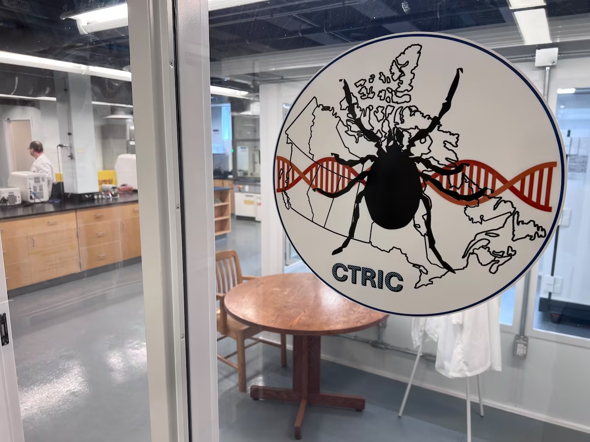

{fig-align="center"}

Researchers at the new Canadian Tick Research and Innovation Centre at Acadia University are now working to monitor these pathogens and develop better preventative measures to protect both the public and the agricultural industry.


