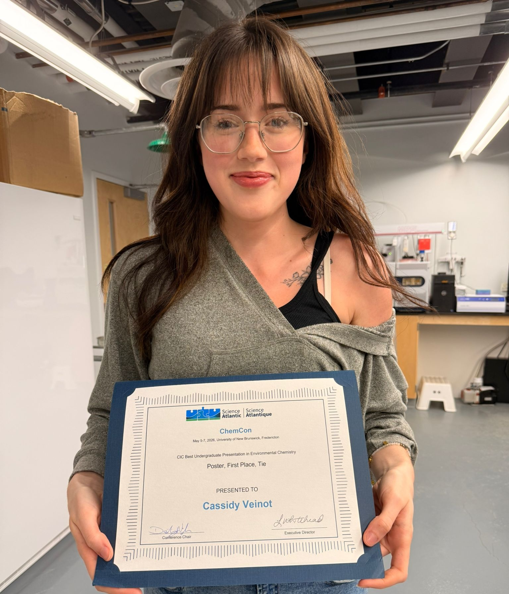

{.featured-img fig-align="center" style="object-position: center 20%;"} A huge congratulations to Cassidy Veinot, who took home the CIC Best Undergraduate Presentation in Environmental Chemistry – Poster award at ChemCon 2026 last week! Cassidy's work explores the use of essential oil-based repellents and acaricides as eco-friendly alternatives to synthetic pesticides, targeting the black-legged and American dog ticks. Well done, Cassidy!


