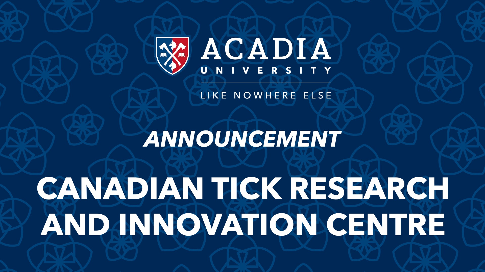

{fig-align="center"}

**August 25, 2026 (11:30 am)**

**Location: McCain Commons, David Huestis Innovation Pavilion**

Join us for a special announcement of funding from the Atlantic Canada Opportunities Agency and Research Nova Scotia for the Canadian Tick Research and Innovation Centre (CTRIC) at Acadia University.

The event will highlight the vital role CTRIC will play in protecting Canadians from ticks and the diseases they carry as their range and populations expand.

Speakers will include the Honourable Kody Blois (Parliamentary Secretary to the Prime Minister and Member of Parliament for Kings-Hants), the Honourable Brian Wong (Minister of Advanced Education and Minister responsible for Research Nova Scotia), and Dr. Nicoletta Faraone (Director, CTRIC).

::: {style="text-align: center;"}
<iframe width="560" height="315" src="https://www.youtube.com/embed/9yVwT60iqBk?si=9Gw8oIzL4Z2oKVCX" title="YouTube video player" frameborder="0" allow="accelerometer; autoplay; clipboard-write; encrypted-media; gyroscope; picture-in-picture; web-share" referrerpolicy="strict-origin-when-cross-origin" allowfullscreen>

</iframe>
:::


